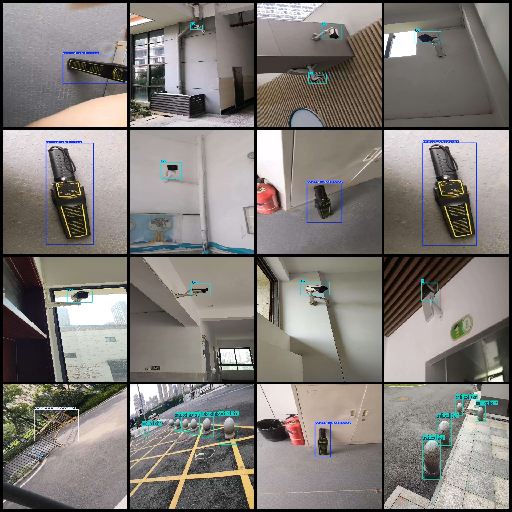
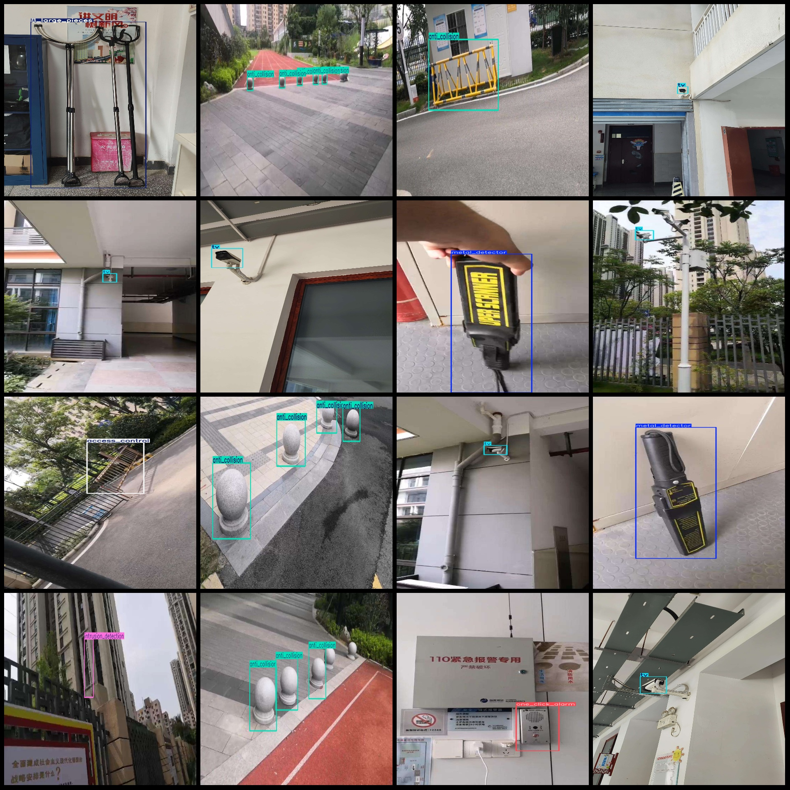

# Campus Safety Facilities and Equipment Detection Data Set - Pascal VOC+YOLO Format - 6784 Images in 9 Categories

Dataset format: Pascal VOC format + YOLO format (without split paths in txt files, only containing jpg images along with corresponding VOC format xml files and yolo format txt files)
Number of images (jpg file count): 6784
Number of annotations (xml file count): 6784
Number of annotations (txt file count): 6784
Number of categories: 9
Annotation category names (Note that the order of yolo format categories does not match this, but is based on the labels folder's classes.txt): ["8_large_pieces", "access_control", "anti_collision", 
"communication_tools", "emergency_gate", "intrusion_detection", "metal_detector", "one_click_alarm", "tv"]
Number of bounding boxes per category:
8_large_pieces (eighteen pieces) = 126
access_control (door access control) = 650
anti_collision (collision prevention devices) = 4681
communication_tools (communication tools) = 29
emergency_gate (emergency gate) = 40
intrusion_detection (intrusion detection devices) = 424
metal_detector (metal detector) = 770
one_click_alarm (one-click alarm devices) = 319
tv (TV) = 4022
Total bounding box count: 11061
Image resolution: Multiple resolution images, such as 1920x3413, 960x544, etc.
Annotation tool used: labelImg
Annotation rules: Draw a rectangle around the category
Important note: No guarantees are made regarding the accuracy of trained models or weight files
Image preview:

## Images

Here is a pay link on Stripe ( https://buy.stripe.com/3cs8yP7sY87d0vu9AB ). Please contact me lonlonago@foxmail.com after funding $89, and I will send you a complete data files , thank you!

